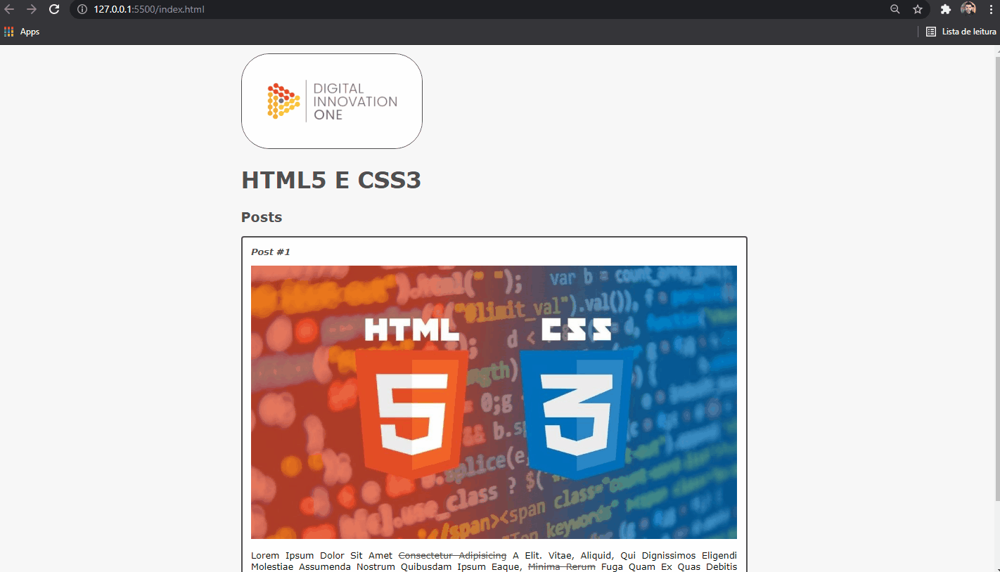

<h1 align="center">
  
</h1>

<h3 align="justify">
Academic demonstration of a basic website made in HTML5 and CSS3 in the Introduction to HTML 5 and CSS3 module of Digital Innovation One.
</h3>

 

## 📷 Demonstration

  

 

## 🚀 Technologies

This project was developed with the following technologies:

- HTML5
- CSS3

 

## ⚙ Settings
- Open with live server 
 

---

Made with 💜 by Rafael Maciel
